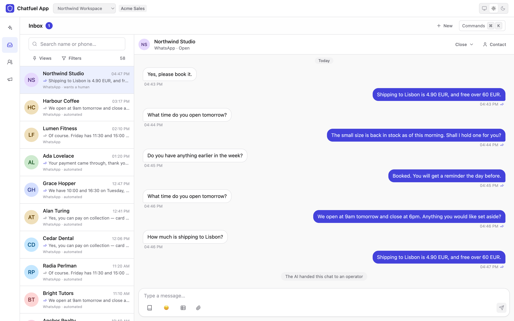
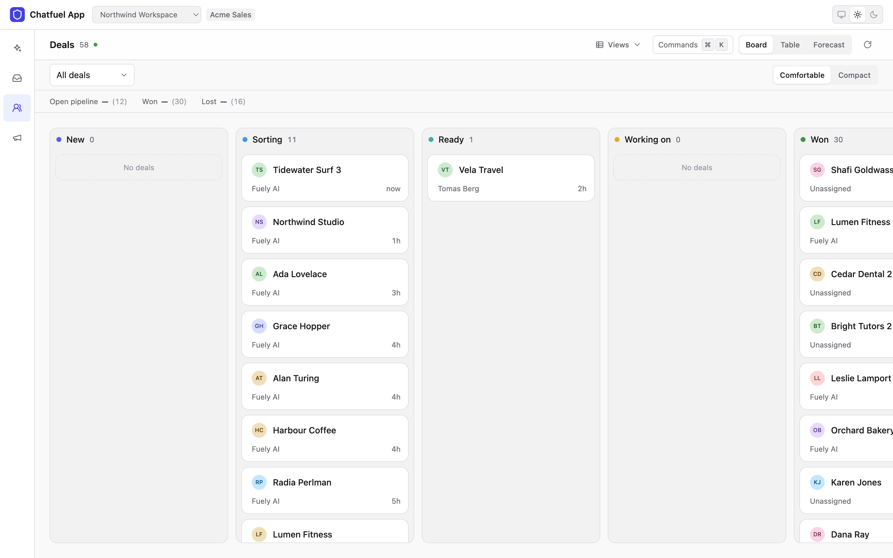

<p align="center">
  <a href="https://chatfuel.com" target="_blank" rel="noopener noreferrer">
    
  </a>
</p>

<h1 align="center">Chatfuel Wizard</h1>

<h3 align="center">Build on your own AI agent platform in one command</h3>

<p align="center">
  Pick the pieces you want. Get a working React app wired to your bot,<br/>
  and the skills your coding agent needs to keep building it.
</p>

<p align="center">
  <a href="https://www.npmjs.com/package/@chatfuel/wizard"></a>
  <a href="https://www.npmjs.com/package/@chatfuel/wizard"></a>
  <a href="https://github.com/chatfuel-lab/wizard/actions/workflows/ci.yml"></a>
  <a href="https://github.com/chatfuel-lab/wizard/blob/main/LICENSE"></a>
  <a href="https://nodejs.org"></a>
  <a href="https://discord.gg/TmrgcjVqFf"></a>
</p>

```bash
npx @chatfuel/wizard
```

<p align="center">
  
</p>

## What you end up with

A React + Vite project you own outright. No framework of ours between you and your code, no
runtime dependency on this repository, and a Chatfuel token that stays on the server. It stays
there in every mode. Whether somebody who reaches the proxy gets to *spend* it is a separate
question, and the one the optional `auth` module answers — see
[docs/deployment.md](docs/deployment.md).

What that module fences is *which bots* a request may touch — not who, inside a bot, is touching
them. Upstream there is one master token, and Chatfuel applies the role of whoever owns it, so any
operation the app sends for even one role is reachable by every signed-in user. The per-module
`useMyRole` hooks decide what the interface offers; they are not an authorization boundary, and
[`content/api-client/src/roles.ts`](content/api-client/src/roles.ts) says so at length. If one
person needs to be able to do less than the token can, that boundary is yours to add.

<p align="center">
  <picture>
    <source media="(prefers-color-scheme: dark)" srcset="docs/images/livechat-dark.png">
    
  </picture>
</p>

Two things people build with it:

- **A tool for your own bot** — an inbox, a CRM, a booking calendar, a catalog, whatever your
  team actually needs, on your own data, with your own workflow in it instead of somebody else's.
- **A product of your own.** Add the `auth` module and the app becomes multi-tenant: anyone can
  sign up, and their account gets an AI agent of its own, created inside your workspace and
  running on your plan. Your branding, your pricing, your customers — Chatfuel is the
  infrastructure underneath.

## Modules

Thirteen. `core` is installed with everything; the rest each add a surface. Pick them in the
wizard, or add them later with `--embed`.

<table>
<tr>
<td width="33%" valign="top">

**Talk to people**

- `livechat` — operator inbox
- `coworker` — the operator's AI assistant
- `publishing` — Instagram posts and Reels

</td>
<td width="33%" valign="top">

**Run the business**

- `contacts` — CRM over your contacts
- `deals` — board, table, forecast
- `bookings` — calendar, staff, services
- `knowledge-base` — what the AI knows

</td>
<td width="33%" valign="top">

**Run the platform**

- `automations` — per-scope AI rules
- `flow-builder` — visual flow editor
- `ads-optimization` — click-to-WhatsApp
- `auth` — sign-in, teams, tenants
- `admin` — the account behind it all

</td>
</tr>
</table>

<p align="center">
  <picture>
    <source media="(prefers-color-scheme: dark)" srcset="docs/images/deals-dark.png">
    
  </picture>
</p>

[docs/modules.md](docs/modules.md) has what each one gives you.

## Try it

```bash
npx @chatfuel/wizard            # scaffold a new app
npx @chatfuel/wizard --embed    # add the modules to a project you already have
npx @chatfuel/wizard doctor     # what the wizard can see before it asks anything
npx @chatfuel/wizard update     # bring an app it made up to this wizard's content
```

You do not need this repository to use the wizard — `npx @chatfuel/wizard` is the whole
install, and Node 22.19.0 or newer is the only prerequisite. The full user guide is
[`packages/wizard/README.md`](packages/wizard/README.md), which is also the npm page.

**The wizard sends no telemetry.** `capture()` in `src/telemetry.ts` is an empty function and
there is no backend behind it; the `capture(...)` calls scattered through the run exist so that
the event vocabulary is settled if one is ever added. Nothing about a run leaves your machine
except the content fetch from GitHub and the calls you asked for.

## Documentation

Everything is under [docs/](docs/README.md), which starts with the two READMEs that come before
it — the CLI's user guide and the one that ships inside the app you get — and then covers the
architecture, every flag and variable, deployment, the thirteen modules, the `--app` presets,
and the errors this stack actually produces.

## Repository map

The top-level directories split on one question: **does this end up on a user's disk?**

- `content/` — everything that does: the app template (`shell`), the three source-only trees
  vendored into a scaffold (`ui`, `api-client`, `vite-plugin-proxy`), the shared codegen body,
  the modules, the schema snapshot, and the skills that belong to no module.
- `packages/` — everything that does not: the published CLI, the manifest schema, and the
  dev-only gallery for the design system.
- `scripts/` — the gates, and `content-trees.ts`, which is the exact list of what travels rather
  than a description of one. `content/ui/src` is a content tree; `content/ui` is not.

[CONTRIBUTING.md](CONTRIBUTING.md#what-may-leave-the-building) has the rules that follow from
that split, and [docs/architecture.md](docs/architecture.md) has what each tree turns into.

## Working on this repo

```bash
pnpm install
```

Node 22.19.0 or newer and pnpm 10.x — the same floor the published CLI runs on. Then [the seven
gates](CONTRIBUTING.md#the-seven-gates), which CI runs exactly.
[CONTRIBUTING.md](CONTRIBUTING.md) has the rest, including the one rule that is easy to trip:
everything the wizard packs is copied onto somebody else's disk.

## Releases

**A commit on `main` reaches users on their next run.** The content is fetched from the branch,
not from the tarball, so a fix to a module needs no release; a release moves the CLI itself.
[CONTRIBUTING.md](CONTRIBUTING.md#what-a-push-reaches-and-what-it-does-not) has the whole table,
including how to pin a run to one commit.

## Community

- [Discussions](https://github.com/chatfuel-lab/wizard/discussions) — questions, ideas,
  and what you built
- [Discord](https://discord.gg/TmrgcjVqFf) — the faster route for "how do I…"
- [Issues](https://github.com/chatfuel-lab/wizard/issues) — something is broken
- [SECURITY.md](SECURITY.md) — vulnerabilities, privately

## License

MIT — see [LICENSE](LICENSE). The apps the wizard generates are yours, under the same license.
