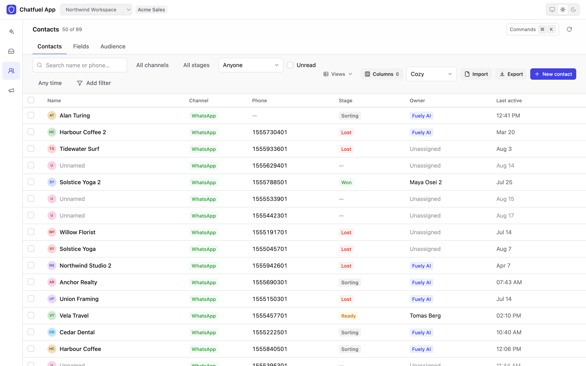

# Modules

Fourteen. `core` is installed with everything and has no interface of its own; the rest each
add a surface to the app. Pick them at scaffold time, or add them later by re-running the
wizard with `--embed`.

| Module | Default | What you get |
| --- | --- | --- |
| `core` | always | Transport and auth, the error envelope, pagination, the CORS proxy spec, the bundled schema, the operation validator. No UI. |
| `livechat` | yes | Operator inbox: conversation list with live updates, per-platform message rendering, composer, take-over, close-to-flow. |
| `contacts` | yes | CRM over Chatfuel contacts: record table with saved views, nested AND/OR attribute filters, inline editing, a Fields surface over the attribute catalog, audience breakdown, CSV import and export. |
| `deals` | yes | Board, table and forecast by sales stage. Drag-and-drop that works on touch, keyboard stage moves, per-card optimistic rollback. Requires `contacts`. |
| `bookings` | yes | Day/week/month calendar, appointments, staff with weekly hours and Google Calendar sync, services catalog, availability-driven booking. |
| `knowledge-base` | yes | Everything the AI knows: business profile, notes, FAQs, product catalog, import and export, a character-budget breakdown, and the questions the assistant had to hand to a human. |
| `automations` | yes | Per-scope AI rules across every channel and entry point, with inheritance, compare, drafts, and an always-open test chat. |
| `coworker` | yes | The operator's own AI assistant, as a full page and as a dock beside every module. Reads the current screen, can navigate the app, and asks before changing anything. |
| `flow-builder` | yes | Visual flow editor: canvas, inspector, block and connection editing, a Test panel. |
| `ads-optimization` | yes | Conversion reporting for click-to-WhatsApp ads: event sets over the ad automations, and the conversions each reports back to Meta. |
| `publishing` | yes | Instagram feed photos, Reels, Stories and carousels against a live preview, published now or queued. Posting on the spot needs nothing else; **scheduling** needs the `auth` module and `ADMIN_PASSWORD`, because the schedule is one row belonging to the deployment rather than to any workspace in it. |
| `channels` | yes | Every channel connected to the bot — WhatsApp, Instagram, TikTok, Facebook pages, the web widget — with Disconnect, and the one-shot links that let somebody without dashboard access connect a new WhatsApp, Instagram or TikTok channel or refresh an existing one's permissions. |
| `auth` | opt-in | Sign-in for the people who use the app: Supabase email and password, one tenant per deployed bot, owner/admin/member, invite links, a Team page. Turns the proxy into a gate. |
| `admin` | opt-in | The account behind the deployment's own token: every workspace and bot, channels, a health page. Opened by a password in the server environment, never by a Chatfuel identity, and never in the navigation rail. |

Opt-in modules are never installed by `--yes`, because both need credentials the wizard cannot
invent. Name them explicitly:

```bash
npx @chatfuel/wizard --modules livechat,contacts,deals,auth
```

`auth` is also `hidden`: it adds no rail item and no route of its own — what it changes is who
may reach anything else.

<p align="center">
  <picture>
    <source media="(prefers-color-scheme: dark)" srcset="images/contacts-dark.png">
    
  </picture>
</p>

## What a module is made of

```
content/modules/<id>/
  module.json      the manifest: id, status, selection, requires, recommends, skill, app (env)
  handoff.md       inlined into your coding agent's instructions file (every module but core)
  skill/           installed into .claude/skills/ or .agents/skills/
content/shell/src/modules/<id>/
                   the React tree: routes, components, hooks, lib
```

The manifest is validated against `packages/module-manifest/module.schema.json` by `pnpm validate`,
so a field that does not exist is a failed gate rather than a silent no-op.

Scaffolding is subtractive: the wizard copies `content/shell` whole and deletes what you did not
pick, regenerating `src/modules/index.ts` and the navigation table on the way out. A module you
did not choose leaves no dead import, no commented-out route, and no `tsconfig` path pointing
at nothing.

## Permissions

A manifest declares the Chatfuel permissions its surfaces need — `Inbox / View` for reading the
inbox, `People / Edit` for changing a contact, and so on. Two declare none and mean it: `core`
is the app frame and `auth` is the sign-in gate, and neither has a surface whose work is a
Chatfuel call a token could be refused for. A token whose account
lacks one gets a refusal from the API, not a blank screen: the module knows which permission
the call wanted and says so.

## Adding one

There is no plugin registry to publish to. A module is a directory, a manifest and a React
tree — copy the smallest existing one, run `pnpm validate`, and the picker offers it. Modules
with `"status": "planned"` are never offered, which is how one lands in the repository before
it is ready to be chosen.
